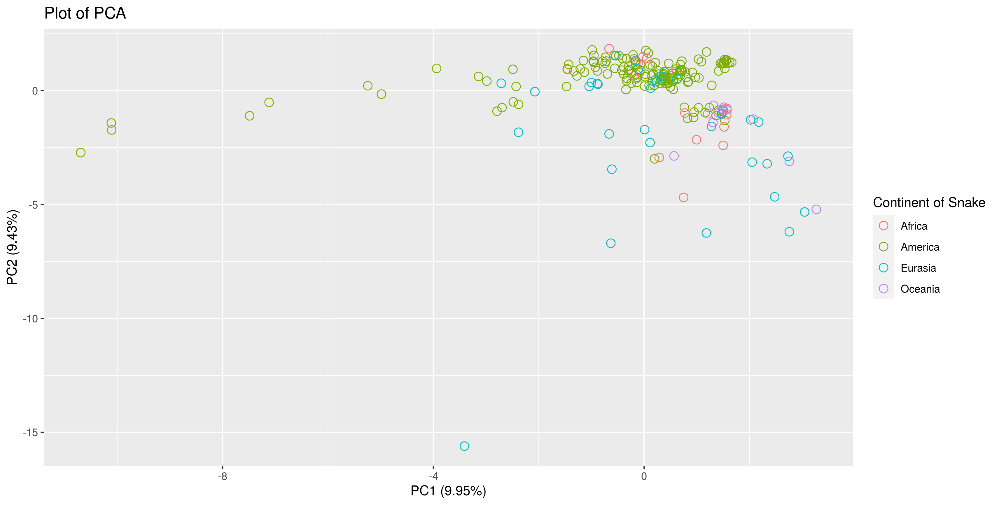
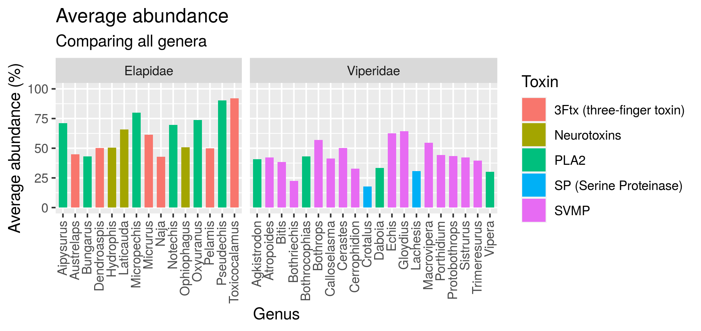

```{r setup, include=FALSE}
knitr::opts_chunk$set(echo = FALSE)
library(tidyverse)
library(knitr)
library(plotly)
library(shiny)
library(maps)
source("../R/99_proj_func.R")
```


## Project requirements
Follow the IMRAD standard scientific structure:
- Introduction
- Materials and Methods
- Results (And)
- Discussion
With a technical focus, but minding to communicate which-ever biological insights you arrived at

Should not include all your code (we will look into that at the individual examinations), but rather focus on the broader picture of what you did and include data summaries and visualisations

Created using ioslides_presentation rmarkdown (i.e. the right-most doc column in the project organisation will be a rmarkdown based presentation)


## Introduction
- Intro to snake venom
- Data set for the study: 
  - Venom compositions from snakes all around the world
- Goal of study:
  - Group snakes by genus based on venom composition (PCA, K-means, ANN)
  
## The dataset
- Main data
- New data, adding three snakes from litterature

## Materials and methods
- Talk about how the data sets are merged 
- Talk about which methods have been used to reach the goal for the study (PCA, K-means, ANN)

## Results from cleaning and augmenting the data
- Show dirty data vs. clean data
- Show region, family, genus, species rows
- Show grouping of the toxin families columns

## Augmented data
```{r}
# Load augmented data
data_aug <- read_csv("../data/03_data_aug.csv")
toxin_names <- data_aug %>% 
  select_if(is.numeric) %>% 
  colnames()
```


## Results from PCA and K-means
<!-- - Plots -->
<!--  -->
```{r out.width = "90%"}

```

## World map
```{r out.width = "90%"}

data_world <- data_aug %>%
distinct(Country, Snake) %>%
count(Country) %>%
arrange(desc(n))

map.world <- map_data("world")


map.world_joined <- map.world %>%
  left_join(data_world, by = c("region" = "Country")) %>%
  rename(count = n)

world <- map.world_joined %>%
  ggplot(aes(x = long, y = lat, group = group, fill = count, label = region)) +
    geom_polygon() +
    scale_fill_gradient(
      low = "#ffded2",
      high = "red"
    ) +
    labs(title = "World map of snake counts",
         x = "Longitude",
         y = "Latitude",
         fill = "Snake count")

ggplotly(world)
```

## Most abundant toxins
```{r out.width = "90%"}

```


## Intra species comparison
```{r out.width = "90%"}
# Bar chart comparing within snake species
intra_species <- data_aug %>% 
  filter(Snake == "Naja kaouthia") %>%
  mutate(Snake = paste(Snake, " (",
                    row_number(), ")",
                    sep = "")) %>%
  pivot_longer(all_of(toxin_names),
               names_to = "Toxin",
               values_to = "Value") %>% 
  # mutate(Value = round(Value, 2)) %>% 
  arrange(desc(Snake)) %>% 
  ggplot(aes(x = Snake, y = Value, fill = Toxin)) +
  geom_col() +
  coord_flip() +
  theme(legend.position = "none") +
  ylab('Venom composition (%)')
ggplotly(intra_species)
```


## Snake family
<!-- ## Comparing snake families -->
```{r out.width = "90%"}
# includeHTML( "../results/04_family_plotly.html")
family_toxins <- data_aug %>%
  pivot_longer(all_of(toxin_names),
               names_to = "Toxin",
               values_to = "Value") %>%
  group_by(Family, Toxin) %>%
  summarise(mean(Value)) %>%
  mutate(Value = round(`mean(Value)`, 2)) %>%
  ggplot(aes(x = Family, y = Value, fill = Toxin)) +
  geom_col() +
  coord_flip() +
  labs(title = "Mean Venom Composition of Viperidae and Elapidae",
       y = "Mean venom composition (%)") +
  theme(legend.position = "none")
ggplotly(family_toxins)
```


<!-- ## Results from ANN -->
<!-- - Plots -->


<!-- ## Discussion -->
<!-- - Discuss results, what can we say about the data based on the study -->

## Compare two snakes
```{r out.width = "80%"}
# includeHTML("../results/04_compareTwo.html")
compareTwo <- data_aug %>%
  filter(Snake %in% c("Naja kaouthia", "Bothrops atrox")) %>%
  pivot_longer(all_of(toxin_names),
               names_to = "Toxin",
               values_to = "Value") %>%
  group_by(Snake, Toxin) %>%
  summarise(mean(Value)) %>%
  mutate(Value = round(`mean(Value)`, 2)) %>%
  filter(Value > 0) %>%
  ggplot(aes(x = Value, y = Snake, fill = Toxin)) +
  geom_col() +
  labs(x = 'Venom composition (%)',
       title = "Comparing venom composition",
       subtitle = "Viperidae: 'Bothrops atrox', Elapidae: 'Naja kaouthia'" ) +
  theme(legend.position = "none")

ggplotly(compareTwo) %>%
  layout(title = list(text = paste0('Comparing venom composition',
                                    '<br>',
                                    '<sup>',
                                    'Viperidae: "Bothrops atrox", Elapidae: "Naja kaouthia"',
                                    '</sup>')))

```


## Shiny app
```{r}
include_app("https://shdam.shinyapps.io/compareTwo/")
```

