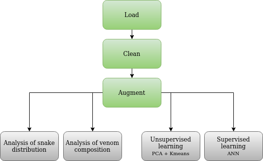
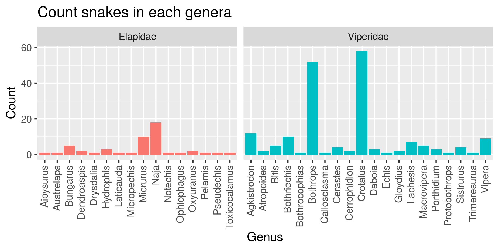
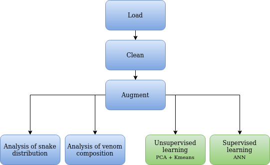
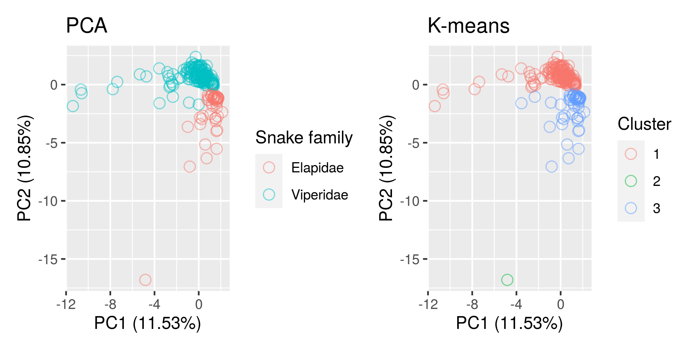
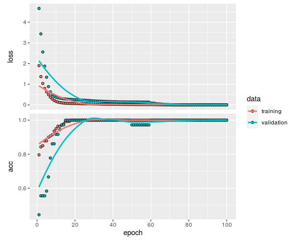
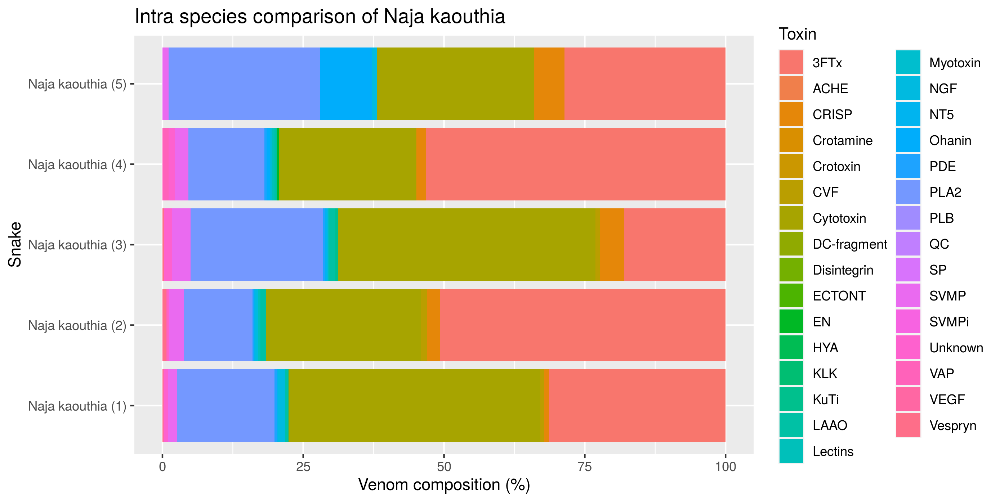

```{r setup, include=FALSE}
knitr::opts_chunk$set(echo = FALSE)
library(tidyverse)
library(knitr)
library(plotly)
```

## Introduction to the study
- Original data
```{r, message = FALSE}
data_raw <- read_csv("../data/_raw/01_data_load_relative.csv")
print(data_raw, width = 80, n = 4, n_extra = 1)
```

- Additional data
```{r, messages = FALSE}
new_data <- read_csv("https://docs.google.com/spreadsheets/d/e/2PACX-1vR1J2-JTgyqdK48fycrWrlC5bqWFHxVatiCLhvWuxnxTJYhuKoq-bMpEvxjL57LwePK819TJAHU-tkC/pub?gid=0&single=true&output=csv", col_types = "cnnn")
print(new_data, width = 80, n = 4, n_extra = 1)
```


## Goal of study
- Perform visual analysis of data distribution
- Develop a tool for venom composition analysis
- Group snakes by family based on venom composition (PCA, K-means, ANN)


## Materials and methods
- Data processing and modelling as well as the creation of this presentation was performed in Rstudio Cloud.

- Coding followed the tidyverse style guide by Hadley Wickham.

- Results obtained from modelling using Artificial Neural Networks were performed in another project.

- Whole project exists at github at: 
https://github.com/rforbiodatascience/2020_group04

*Used packages:*
*httr, readxl, tidyverse, knitr, plotly, maps, patchwork, shiny, rsconnect, keras, devtools*


## Project outline
```{r, out.width= "60%", out.extra='style="float:right; padding:10px"'}

```

- Loading and cleaning data
  - Map locations to country
- Augmentation of data
  - Merge datasets
  - Create genus and species columns
  - Group toxins
- Analysis and visualisations
  - Geographical and genus distribution
  - Venom composition analysis
- Unsupervised analysis
  - PCA
  - K-means clustering
- Supervised classification model
  - Artificial Neural Network (ANN)


## Tidying and transforming data
- Tidy raw data
  - Load and clean data
- Transform data
  - Join new data
  - Group toxins
  - Remove toxins found in fewer than five snakes
  - Map genus to snake family
```{r, message = FALSE}
# Load augmented data
data_aug <- read_csv("../data/03_data_aug.csv")
print(data_aug, width = 80, n = 7, n_extra = 1)
```

## Analysis and visualisations
<p align="center">
```{r, out.width = "70%"}

```
</p>
## Geographical overview of samples

Snakes from richer countries or countries with a focus on snake research is overrepresented.

```{r, out.width = "90%"}
load("../results/04_world_of_snakes.Rdata")
world_plotly
```


## Genus distribution according to family
```{r, out.width = "90%"}

```

## Venom composition in snake families
```{r, out.width = "90%"}
include_graphics("../results/05_family_legend.png")
```


## Venom composition in snake families
```{r, out.width = "90%"}
load("../results/05_family_plotly.Rdata")
family_plotly
```

## Toxin abundances
```{r, out.width = "90%"}
include_graphics("../results/05_avg_toxin_genus.png")
```


<!-- ## Discussion -->
<!-- - Discuss results, what can we say about the data based on the study -->

## Comparing venom composition between species
```{r, out.width = "90%"}
load("../results/05_compare_two.Rdata")
compare_two_plotly
```


## Comparing venom composition within species
```{r, out.width = "90%"}
# Bar chart comparing within snake species
load("../results/05_intra_species.Rdata")
intra_species_plotly
```


## Shiny app
```{r}
include_app("https://shdam.shinyapps.io/compareTwo/")
```


## Unsupervised and supervised learning
<p align="center">
```{r, out.width = "70%"}

```
</p>


## Results from PCA and K-means
```{r, out.width = "90%", fig.align = "center"}

```

## Prediction model based on venom composition
```{r, out.width= "50%", out.extra='style="float:right; padding:10px"'}

```
A simple vanilla ANN managed to achieve a classification accuracy of 98.2 %

- Specifications: 4 hidden neurons, test set size: 25 %, validation set size: 20 %, learning rate = 0.005, n_epocs = 100, loss criterion = Binary Crossentropy.


## Theoretic analysis of incorrect labels
The one snake being misclassified, is incorrectly labeled as Elapidae. 

<p align="center">
```{r, out.width = "50%"}


```
</p>

## Analysis of special cases

Incorrectly labeled snake by ANN:
```{r, message=FALSE}
read_csv('../results/07_incorrect_pred.csv') %>%
  select(Snake, Family)
```

Snake from K-means cluster 2:
```{r, message=FALSE}
load("../results/06_kmeans_cluster2.Rdata")
cluster2 %>% 
  select(Snake, Family)
```

## Shiny app
```{r}
include_app("https://shdam.shinyapps.io/compareTwo/")
```

## Static plots for publication

```{r, out.width = "90%", fig.align = "center"}
include_graphics("../results/05_family_legend.png")
```


## Static plots for publication
```{r, out.width = "90%"}
# includeHTML("../results/04_compareTwo.html")
include_graphics("../results/05_compare_two.png")
```

## Static plots for publication
```{r, out.width = "90%"}
# Bar chart comparing within snake species

```


