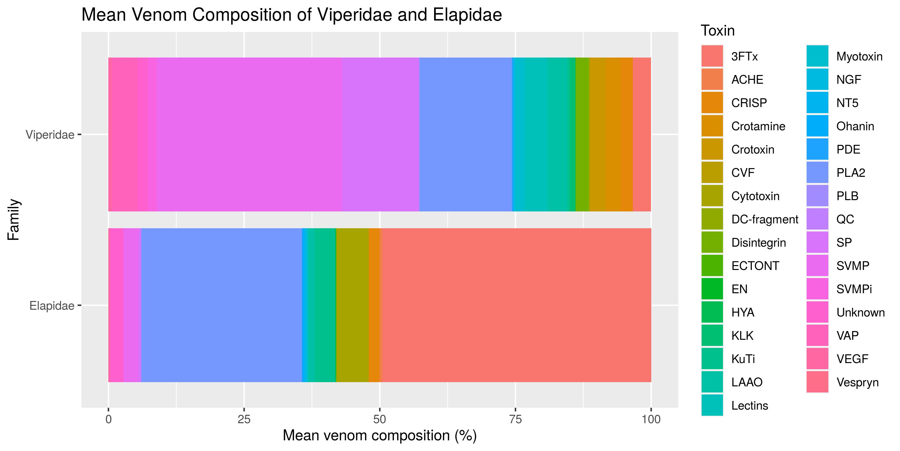
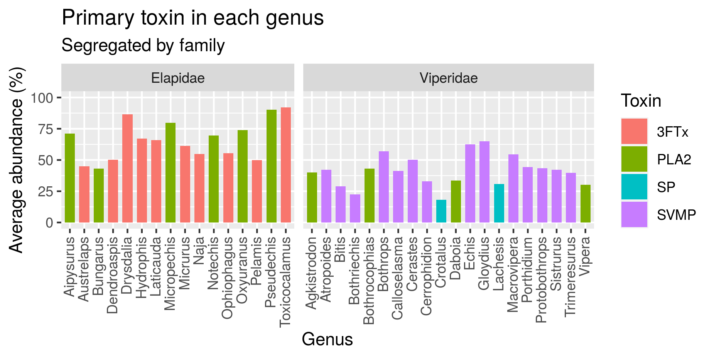
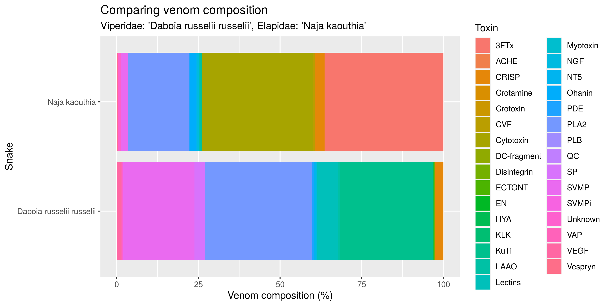

```{r setup, include=FALSE}
knitr::opts_chunk$set(echo = FALSE)
library(tidyverse)
library(knitr)
library(plotly)
library(maps)
source("../R/99_proj_func.R")
```


## Project requirements
Follow the IMRAD standard scientific structure:
- Introduction
- Materials and Methods
- Results (And)
- Discussion
With a technical focus, but minding to communicate which-ever biological insights you arrived at

Should not include all your code (we will look into that at the individual examinations), but rather focus on the broader picture of what you did and include data summaries and visualisations

Created using ioslides_presentation rmarkdown (i.e. the right-most doc column in the project organisation will be a rmarkdown based presentation)

## Project outline:

- Loading and cleaning data
  - Merge datsets
  - Map locations to country
- Augmentation of data
  - Group snake subspecies and venom types
- Initial Analysis and visualisations
  - Venom composition
  - Geographical distribution
- Unsupervised analysis
  - PCA
  - K-means clustering
- Supervised classification model
  - Artificial Neural Network (ANN)


## Introduction
- Intro to snake venom
- Data set for the study: 
  - Venom compositions from snakes all around the world
- Goal of study:
  - Group snakes by genus based on venom composition (PCA, K-means, ANN)
  
## The datasets
- Main data
```{r, message = FALSE}
data_raw <- read_csv("../data/_raw/01_data_load_relative.csv")
print(data_raw, width = 80, n = 4, n_extra = 1)
```

- New data
```{r, messages = FALSE}
new_data <- read_csv("https://docs.google.com/spreadsheets/d/e/2PACX-1vR1J2-JTgyqdK48fycrWrlC5bqWFHxVatiCLhvWuxnxTJYhuKoq-bMpEvxjL57LwePK819TJAHU-tkC/pub?gid=0&single=true&output=csv", col_types = "cnnn")
print(new_data, width = 80, n = 4, n_extra = 1)
```


## Materials and methods
Data processing and modelling performed in Rstudio Cloud
  Used packages:
  httr, tidyverse, readxl, googlesheets4, shiny, knitr, plotly, maps, patchwork, rsconnect
  
Whole project exists at github at: 
https://github.com/rforbiodatascience/2020_group04


## Augmented data
- Join new data
- Group toxins
- Remove toxins with few occurances
- Map genus to snake family
```{r, message = FALSE}
# Load augmented data
data_aug <- read_csv("../data/03_data_aug.csv")
toxin_names <- data_aug %>% 
  select_if(is.numeric) %>% 
  colnames()

print(data_aug, width = 80, n = 4, n_extra = 1)
```


## Geographical overview of samples

Snakes from richer countries or countries with a focus on snake research is overrepresented.

```{r, out.width = "90%"}
load("../results/04_world_of_snakes.Rdata")
world_plotly
```


## Snake family count
```{r, out.width = "90%"}
include_graphics("../results/04_genus_distribution.png")
```

## Snake family
```{r, out.width = "90%"}

```


## Snake family
<!-- ## Comparing snake families -->
```{r}
load("../results/05_family_plotly.Rdata")
family_plotly
```

## Most abundant toxins
```{r, out.width = "100%"}

```


<!-- ## Discussion -->
<!-- - Discuss results, what can we say about the data based on the study -->

## Compare two snakes
```{r, out.width = "90%"}
# includeHTML("../results/04_compareTwo.html")
load("../results/05_compare_two.Rdata")
compare_two_plotly
```

## Intra species comparison
```{r, out.width = "90%"}
# Bar chart comparing within snake species
load("../results/05_intra_species.Rdata")
intra_species_plotly
```


## Shiny app
```{r}
include_app("https://shdam.shinyapps.io/compareTwo/")
```

## Results from PCA and K-means
<!-- - Plots -->
<!--  -->
```{r, out.width = "90%", fig.align = "center"}
include_graphics("../results/06_kmeans-family.png")
```

## Prediction models based on venom composition
- A smiple vanilla ANN managed to correctly classify the whole testset (25 % of data)
  - Specifications: 4 hidden neurons, learning rate = 0.001, n_epocs = 100, loss criterion = Binary Crossentropy
<!-- - Prediction of which continent, the snake originated from  -->
<!--   - Attempted a number of architechtures ranging from 1 to 4 hidden layers, with/without dropout and tried optimizing hyperparameters. -->
<!--   - Problems with overfitting - further regularization e.g. early stopping might be a solution -->
<!--   - Question might be ill posed - venom composition predicts snake family and not necessarily location. e.g. snakes from two different families both from the same country have completely different venom compositions. -->

## Training of ANN predicting snake family

<p align="center">
```{r, out.width = "50%"}
include_graphics("../results/07_ANN_family_training.png")

```
</p>
## Analysis of incorrect labels (1)

- If test size is increased to 40 %, the model misclassifies 5 snakes as illustrated below:


<p align="center">
```{r, out.width = "50%"}
include_graphics("../results/07_accuracy_plot.png")

```
</p>

## Analysis of incorrect labels (2)

Analysis of the venom composition of the incorrectly labeled snakes:

<p align="center">
```{r, message=FALSE}
read_csv('../results/07_incorrect_pred.csv') %>%
  select(Snake, Family)

```
</p>

## Shiny app
```{r}
include_app("https://shdam.shinyapps.io/compareTwo/")
```


## Static plots

## Compare two snakes
```{r, out.width = "90%"}
# includeHTML("../results/04_compareTwo.html")

```

## Intra species comparison
```{r, out.width = "90%"}
# Bar chart comparing within snake species
include_graphics("../results/05_intra_species.png")
```


